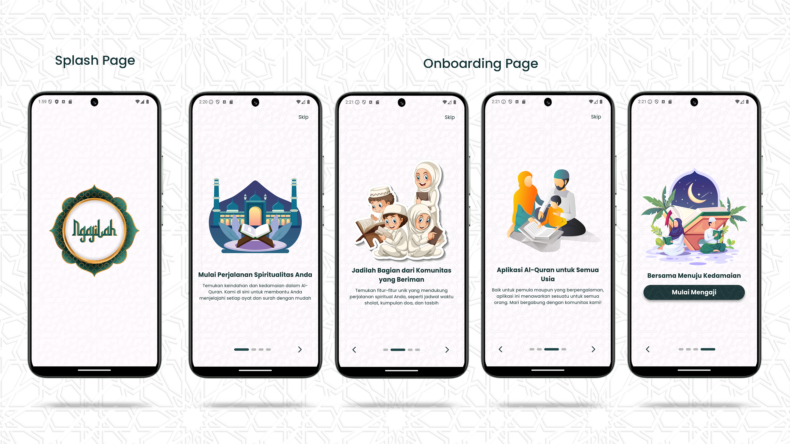
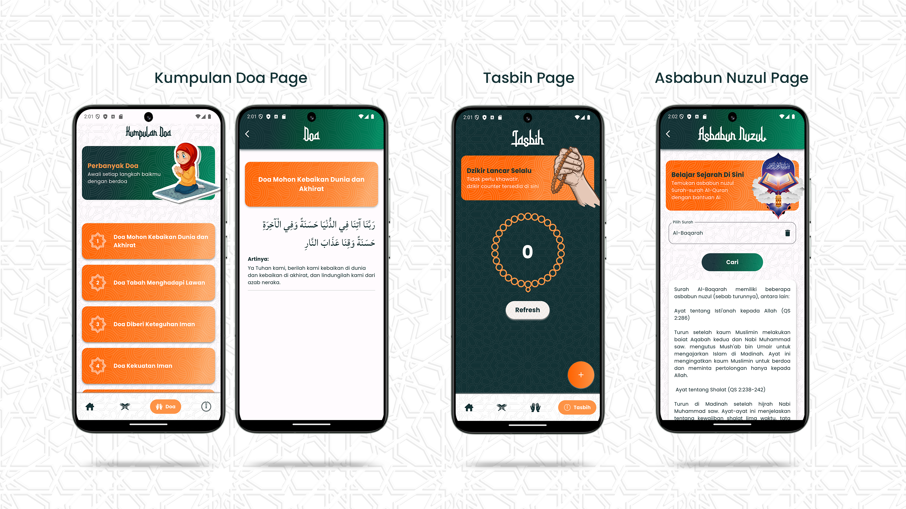

# NgajiLah App  
  
  
  
**NgajiLah** adalah sebuah aplikasi Al-Quran yang di dalamnya terdapat banyak fitur menarik seperti menampilkan ayat-ayat Al-Quran berdasarkan **Surah** dan **Juz**, kumpulan doa, tasbih, sampai implementasi **AI** untuk memberikan informasi terkait **Asbabun Nuzul Surah** (sebab diturunkannya Surah). **NgajiLah** dibuat untuk menjadi solusi bagi kaum muslim yang ingin memperkuat keimanannya akan tetapi juga tidak ingin ketinggalan zaman.  
  
Berikut adalah tampilan dari **NgajiLah App** :  
  
  
  
  
  
  
  
Download **NgajiLah App** di sini:  
[Klik di sini](https://bit.ly/NgajiLahv1)  
  